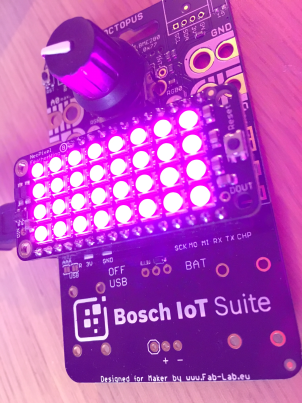
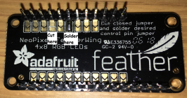

# octopus-neopixel-featherwing
NeoPixel FeatherWing example for IoT Octopus, the badge for IoT Evaluation by fab-lab.eu

## External libraries
This example requires an external Arduino library:

Adafruit NeoPixel by Adafruit

More information at https://github.com/adafruit/Adafruit_NeoPixel

## Hardware purchase
* Octopus IoT Badge: https://www.tindie.com/products/FabLab/iot-octopus-badge-for-iot-evaluation/
* Adafruit NeoPixel FeatherWing: https://www.exp-tech.de/displays/led/6831/adafruit-neopixel-featherwing-4x8-rgb-led-add-on-for-all-feather-boards (Germany) or https://www.adafruit.com/product/2945

## Jumper settings on NeoPixel FeatherWing
On the bottom of the NeoPixel FeatherWing, there is a range of pins that are available for use as the 'control pin'.
Per default, this is (Arduino) pin 16 but that doesn't work with the Octopus badge. 
Cut this preset jumper with a sharp knife.
With the Octopus board, we use (Arduino) pin 15 as 'control pin'.
Solder across the jumper to set this pin as 'control pin'.

## Functionality
* This example sends pulses in random colors.
